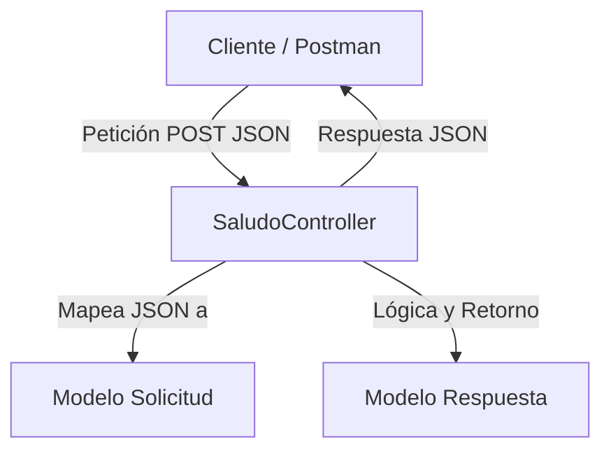
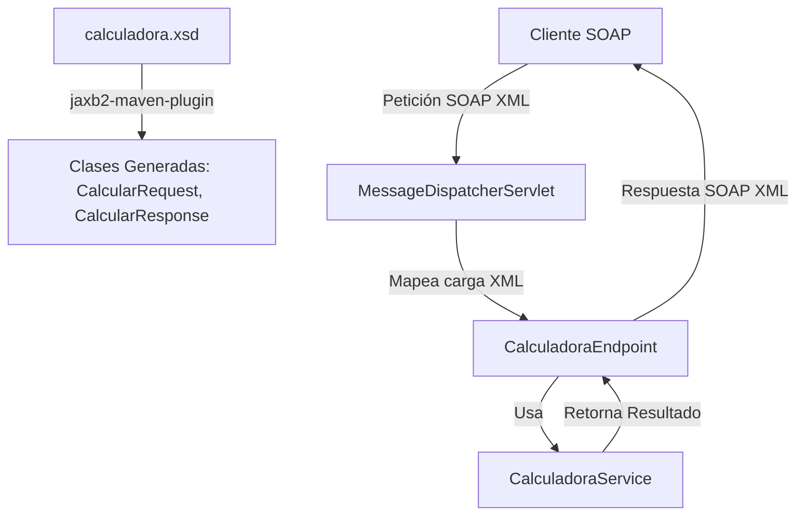
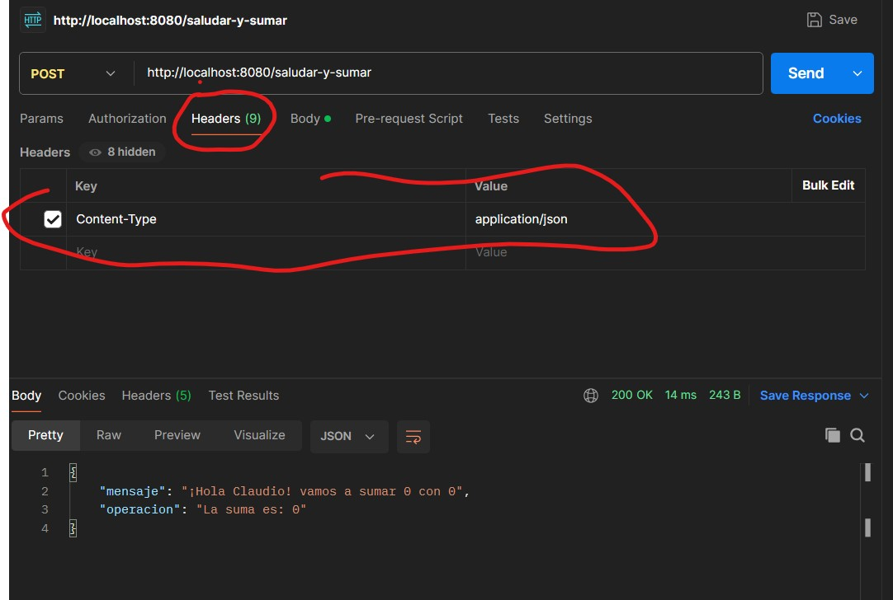
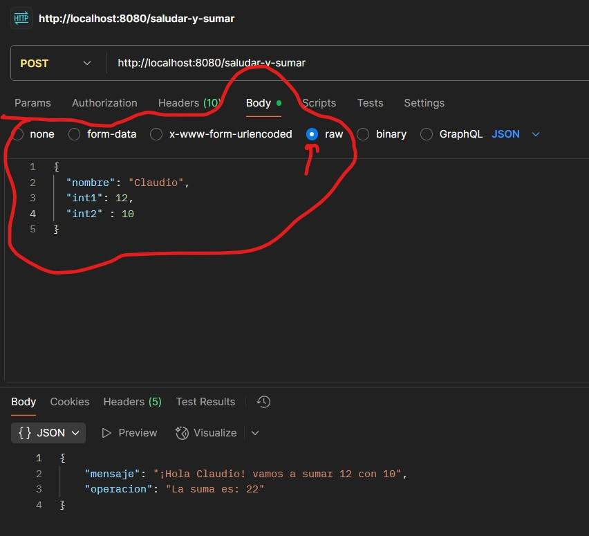

# Guía de Aprendizaje: Servicios Web SOAP y REST con Spring Boot

Esta guía está diseñada para ayudarte a comprender los conceptos fundamentales de los **Servicios Web (Web Services)** a través de una comparación práctica entre dos proyectos reales implementados en Spring Boot:
1. [**demo_rest**](file:///c:/java/demo_rest): Un servicio web de estilo arquitectónico **REST** que utiliza JSON.
2. [**calculadora-soap**](file:///c:/java/calculadora-soap): Un servicio web basado en el protocolo **SOAP** que utiliza XML y un contrato formal definido por un esquema XSD.

---

## 1. Conceptos Fundamentales: SOAP vs REST

Antes de entrar en el código, es crucial entender en qué se diferencian estas dos tecnologías de comunicación entre sistemas:

| Característica | SOAP (Simple Object Access Protocol) | REST (Representational State Transfer) |
| :--- | :--- | :--- |
| **Definición** | **Protocolo** estricto y estandarizado con reglas predefinidas. | **Estilo arquitectónico** con directrices y restricciones flexibles. |
| **Formato de datos** | Exclusivamente **XML**. | Múltiples formatos (usualmente **JSON**, pero también XML, texto, HTML). |
| **Contrato de Servicio** | **Obligatorio**: Definido mediante un archivo **WSDL** (y esquemas **XSD**). | **Opcional**: Autodescriptivo, aunque se suele documentar con OpenAPI/Swagger. |
| **Transporte** | Puede usar HTTP, SMTP, JMS, etc. | Principalmente **HTTP/HTTPS**. |
| **Operaciones** | Basado en acciones (ej. "sumar", "restar"). Se usa POST para casi todo. | Basado en recursos (URIs) y métodos HTTP estandarizados (GET, POST, PUT, DELETE). |
| **Rendimiento** | Más pesado debido al formato XML y la cabecera (Envelope). | Más ligero, eficiente y rápido de parsear gracias a JSON. |
| **Casos de Uso** | Sistemas financieros, bancarios o empresariales antiguos que requieren alta seguridad (WS-Security) y transaccionalidad estricta. | Aplicaciones web modernas, apps móviles, microservicios y APIs públicas en general. |

---

## 2. Análisis del Proyecto REST: `demo_rest`

El proyecto [demo_rest](file:///c:/java/demo_rest) expone un servicio web REST que permite realizar operaciones matemáticas y saludos mediante el intercambio de objetos JSON.

### Estructura de Clases Clave



### 1. El Controlador REST: [SaludoController.java](file:///c:/java/demo_rest/src/main/java/com/example/demo_rest/SaludoController.java)
Este componente gestiona las peticiones HTTP entrantes.

* **`@RestController`**: Indica a Spring que esta clase es un controlador donde los métodos devuelven datos directamente en el cuerpo de la respuesta HTTP (habitualmente serializados en JSON) en lugar de renderizar una vista HTML.
* **`@PostMapping`**: Mapea peticiones HTTP POST a rutas específicas como `/saludar-y-sumar`, `/saludar-y-restar`, u `/operar`.
* **`@RequestBody`**: Le indica a Spring que tome el cuerpo de la petición HTTP (JSON) y lo deserialice automáticamente en un objeto Java de tipo `Solicitud`.

Ejemplo de endpoint en el controlador:
```java
@PostMapping("/operar")
public Respuesta operar(@RequestBody Solicitud solicitud) {
    String mensaje = "Operación " + solicitud.getNombre() + ". ";
    float resultado;
    switch (solicitud.getNombre()) {
        case "suma":
            resultado = solicitud.getInt1() + solicitud.getInt2();
            break;
        case "resta":
            resultado = solicitud.getInt1() - solicitud.getInt2();
            break;
        case "multiplicacion":
            resultado = solicitud.getInt1() * solicitud.getInt2();
            break;
        case "division":
            resultado = solicitud.getInt1() / solicitud.getInt2();
            break;
        case "potencia":
            resultado = (float) Math.pow(solicitud.getInt1(), solicitud.getInt2());
            break;
        default:
            resultado = 0;
            break;
    }
    mensaje = mensaje + "Vamos a operar " + solicitud.getInt1() + " con " + solicitud.getInt2();
    return new Respuesta(mensaje, "Resultado: " + resultado);
}
```

### 2. Los Modelos de Datos: [Solicitud.java](file:///c:/java/demo_rest/src/main/java/com/example/demo_rest/Solicitud.java) y [Respuesta.java](file:///c:/java/demo_rest/src/main/java/com/example/demo_rest/Respuesta.java)
Son simples clases Java (POJOs) que representan las estructuras de datos de entrada y salida:
* **`Solicitud`**: Contiene campos como `nombre`, `int1`, e `int2` con sus respectivos métodos getter/setter que Jackson (la biblioteca interna de Spring) usa para mapear las propiedades JSON.
* **`Respuesta`**: Contiene `mensaje` y `operacion`. Al retornar un objeto de esta clase en el controlador, Spring lo transforma automáticamente en un objeto JSON.

---

## 3. Análisis del Proyecto SOAP: `calculadora-soap`

El proyecto [calculadora-soap](file:///c:/java/calculadora-soap) implementa un servicio SOAP clásico. A diferencia de REST, este enfoque es **"contract-first"** (primero el contrato): primero se define la estructura de datos mediante un esquema XML (`.xsd`) y luego se genera el código Java y el documento WSDL.

### Flujo de Trabajo en SOAP



### 1. El Esquema XML de Datos: [calculadora.xsd](file:///c:/java/calculadora-soap/src/main/resources/calculadora.xsd)
Define las reglas del juego. Especifica de forma estricta los elementos válidos que pueden enviarse y recibirse:
* **`CalcularRequest`**: Requiere un `numero1` (entero), un `numero2` (entero), y una `operacion` (cadena de texto).
* **`CalcularResponse`**: Retornará un `resultado` (decimal/double) y un `mensaje` (cadena de texto).

```xml
<xs:element name="CalcularRequest">
    <xs:complexType>
        <xs:sequence>
            <xs:element name="numero1" type="xs:int"/>
            <xs:element name="numero2" type="xs:int"/>
            <xs:element name="operacion" type="xs:string"/>
        </xs:sequence>
    </xs:complexType>
</xs:element>
```

### 2. Configuración de Maven y Generación de Código: [pom.xml](file:///c:/java/calculadora-soap/pom.xml)
Para que Java entienda estos elementos XML, usamos el plugin `jaxb2-maven-plugin`. Este plugin analiza el archivo `.xsd` durante la compilación y genera clases Java estándar (como `CalcularRequest.java` y `CalcularResponse.java`) con anotaciones especiales de JAXB (Java Architecture for XML Binding) dentro del directorio `target/generated-sources/jaxb/`.

### 3. Configuración del Servidor SOAP: [WebServiceConfig.java](file:///c:/java/calculadora-soap/src/main/java/com/example/calculadora_soap/config/WebServiceConfig.java)
Este archivo configura los componentes clave para servir SOAP:
* **`@EnableWs`**: Habilita las capacidades de Web Services de Spring en la aplicación.
* **`MessageDispatcherServlet`**: Es el servlet principal de Spring WS que intercepta todas las peticiones que van hacia `/ws/*`. Se encarga de analizar los mensajes SOAP entrantes y dirigirlos al endpoint adecuado.
* **`DefaultWsdl11Definition`**: Expone automáticamente un WSDL dinámico. Toma el esquema `calculadora.xsd` y genera un archivo descriptivo WSDL que los clientes pueden descargar para saber cómo usar el servicio.

El WSDL dinámico queda expuesto en:
`http://localhost:8085/ws/calculadora.wsdl`

### 4. El Endpoint SOAP: [CalculadoraEndpoint.java](file:///c:/java/calculadora-soap/src/main/java/com/example/calculadora_soap/endpoint/CalculadoraEndpoint.java)
Actúa de manera similar a un controlador de REST, pero está especializado en procesar mensajes XML SOAP:
* **`@Endpoint`**: Registra la clase como un componente que maneja peticiones SOAP.
* **`@PayloadRoot`**: Define a qué espacio de nombres (`namespace`) y elemento raíz (`localPart`) responde este método. En este caso, reacciona cuando recibe un elemento `<CalcularRequest>` bajo el namespace `http://ejemplo.com/calculadora`.
* **`@RequestPayload`**: Indica que el parámetro del método (`CalcularRequest`) se mapeará a partir del cuerpo (payload) del mensaje SOAP XML recibido.
* **`@ResponsePayload`**: Indica que el valor de retorno (`CalcularResponse`) debe ser envuelto en el cuerpo del mensaje XML SOAP de respuesta.

```java
@PayloadRoot(namespace = NAMESPACE_URI, localPart = "CalcularRequest")
@ResponsePayload
public CalcularResponse calcular(@RequestPayload CalcularRequest request) {
    CalcularResponse response = new CalcularResponse();
    try {
        double resultado = procesarOperacion(request);
        response.setResultado(resultado);
        response.setMensaje("Operación exitosa");
    } catch (Exception e) {
        response.setResultado(0);
        response.setMensaje("Error: " + e.getMessage());
    }
    return response;
}
```

### 5. La Lógica de Negocio: [CalculadoraService.java](file:///c:/java/calculadora-soap/src/main/java/com/example/calculadora_soap/service/CalculadoraService.java)
Es un servicio Spring estándar (`@Service`) que contiene métodos puramente matemáticos: suma, resta, multiplicación, división, potencia y raíz cuadrada, implementando controles de errores comunes (como dividir por cero o calcular la raíz de un número negativo).

---

## 4. Pruebas de Funcionamiento en Postman

Para probar y ver las diferencias estructurales de los datos de ambos servicios, puedes utilizar Postman:

### 1. Petición en el Servicio REST (Puerto 8080)
* **URL**: `http://localhost:8080/operar`
* **Método**: `POST`
* **Headers**: `Content-Type: application/json`
* **Cuerpo (JSON)**:
  ```json
  {
      "nombre": "suma",
      "int1": 15,
      "int2": 10
  }
  ```
* **Respuesta Esperada (JSON)**:
  ```json
  {
      "mensaje": "Operación suma. Vamos a operar 15 con 10",
      "operacion": "Resultado: 25.0"
  }
  ```

---

### 2. Petición en el Servicio SOAP (Puerto 8085)
* **URL**: `http://localhost:8085/ws`
* **Método**: `POST`
* **Headers**:
  * Es importante establecer el encabezado de contenido correcto para indicarle al servidor que procese XML SOAP:
  
  
  *(Configurar `Content-Type: text/xml` y opcionalmente `SOAPAction` según requiera el WSDL).*

* **Cuerpo (XML)**:
  La petición debe estar estructurada dentro del estándar SOAP, usando un envoltorio llamado `Envelope` y un bloque `Body`:
  
  

  *Código XML del Body para copiar y probar:*
  ```xml
  <soapenv:Envelope xmlns:soapenv="http://schemas.xmlsoap.org/soap/envelope/"
                    xmlns:calc="http://ejemplo.com/calculadora">
     <soapenv:Header/>
     <soapenv:Body>
        <calc:CalcularRequest>
           <calc:numero1>10</calc:numero1>
           <calc:numero2>5</calc:numero2>
           <calc:operacion>multiplicar</calc:operacion>
        </calc:CalcularRequest>
     </soapenv:Body>
  </soapenv:Envelope>
  ```

* **Respuesta Esperada (XML)**:
  ```xml
  <SOAP-ENV:Envelope xmlns:SOAP-ENV="http://schemas.xmlsoap.org/soap/envelope/">
     <SOAP-ENV:Header/>
     <SOAP-ENV:Body>
        <ns2:CalcularResponse xmlns:ns2="http://ejemplo.com/calculadora">
           <ns2:resultado>50.0</ns2:resultado>
           <ns2:mensaje>Operación exitosa</ns2:mensaje>
        </ns2:CalcularResponse>
     </SOAP-ENV:Body>
  </SOAP-ENV:Envelope>
  ```

---

## 5. Ejercicios Prácticos Sugeridos para Alumnos

Para afianzar lo aprendido, intenta realizar las siguientes modificaciones:

### Ejercicio A: Ampliar el Servicio REST (demo_rest)
1. Abre el archivo [SaludoController.java](file:///c:/java/demo_rest/src/main/java/com/example/demo_rest/SaludoController.java).
2. Añade un caso `"modulo"` en el switch de la ruta `/operar` que devuelva el residuo de la división entre `int1` e `int2` (`int1 % int2`).
3. Inicia el proyecto `demo_rest` y pruébalo en Postman enviando un JSON con `"nombre": "modulo"`.

### Ejercicio B: Ampliar el Servicio SOAP (calculadora-soap)
1. Abre [CalculadoraService.java](file:///c:/java/calculadora-soap/src/main/java/com/example/calculadora_soap/service/CalculadoraService.java) y añade el método `modulo(int a, int b)`.
2. Modifica [CalculadoraEndpoint.java](file:///c:/java/calculadora-soap/src/main/java/com/example/calculadora_soap/endpoint/CalculadoraEndpoint.java) para contemplar el caso `"modulo"` o `"mod"`.
3. Compila el proyecto con Maven para asegurar que todo esté correcto y pruébalo enviando la petición XML correspondiente en Postman a `http://localhost:8085/ws`.
